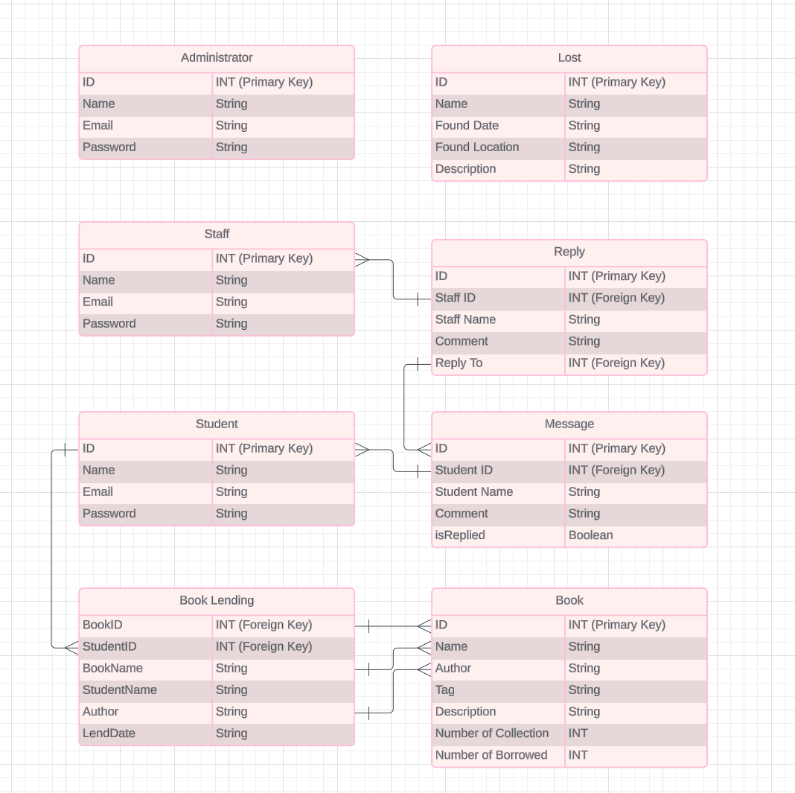

# COMP3019J_Project

## Team members

Our team has four numbers. Here are our Chinese names and UCD number.
- **Qiyue Zhu** StudentID: 22207232
- **Wenyi Liang** Student ID: 22207277
- **Boran Duan** Student ID: 22207281
- **Yani Yang** Student ID: 22207291


## Introduction to the Library Management System
Welcome to our Library Management System! This system aims to provide users with an efficient and convenient platform for book borrowing and management. Below are the main features of the system and our future development goals:

- Login and Registration of Personal Information: Users can enjoy all the features provided by the system by registering an account. After registration, users can update their personal information, view borrowing records, and manage account settings to ensure the security and privacy of their data.

- Borrowing and Returning Books: Users can easily browse the books in the system and borrow them. Each user has a borrowing limit and overdue fines, which will be automatically updated in their personal account. Users can also view their borrowing history and a list of currently borrowed books when returning items.

- Lost and Found: If users lose items in the library or during the borrowing process, they can submit item information through the lost and found feature for other users to view and contact the owner. And it’s the same case with the users or staffs who found something they thought being left behind. This function aims to enhance interaction and support among users.

- Message Board: Users can communicate with system administrators or other users through the messaging feature to provide suggestions or feedback. This function not only enhances the user experience but also helps us continuously improve the system.

- Future Goals: Our goal is to continuously optimize the system and add more user-friendly features, such as online reservations, recommendation systems, and mobile application support, to enhance the user experience and meet the growing demands of our users.

## Login and Registration of Personal Information
Users can enjoy all the features provided by the system by registering an account.
### Administrator/Staff/Student Login:
There are one screenshot for administrator/staff/student to log into the system.

#### Editing Login Information Process:
1. **Login in the account:** Users select their identity as either an administrator, staff, or student by choosing "identification," fill in their email and password to access the system.
#### Cancel Login Process:
1. **Cancel Login the information:** Users fill the information about the account and users click the 'Cancel' button to cancel the login process for the account.
#### General Interface Elements：
1. **Identification Button:** Users can select their role (Administrator, Staff, or Student) before logging in, which helps direct them to the appropriate interface.
2. **Login Button:** After entering their credentials, users click this button to authenticate their account and gain access to the system.
3. **Cancel Button:** This button allows users to cancel the login process and return to the previous menu.


### Administrator/Staff/Student Register:
There are two screenshots for administrator/staff/student to register into the system.


#### Register a New Account Process:
1. **Navigation:** User clicks "sign in" button on the login page and go to the createAccount page.
2. **Creating new account:** Users select their identity as either an administrator, staff, or student by choosing "identification," fill in their email and password, and verify the password. They click "Sign in" to create an account and return to the login page.
3. **Login in the account:** Back to the login page,  users can enter the account information they just registered to access the system.


#### Cancel a New Account Process:
1. **Navigation:** User clicks "sign in" button on the login page and go to the createAccount page.
2. **Creating new account:** Users select their identity as either an administrator, staff, or student by choosing "identification," fill in their email and password, and verify the password. They click "Cancel" to cancel the creation of a new account, and return to the login page.
#### General Interface Elements：
1. **Sign Up Button:** Users can click this button after filling out their registration details to create a new account.
2. **Input Fields:** Users are required to fill in personal information such as name, email, role, and password.
3. **Validation Messages:** The system provides feedback on the registration form, indicating any errors or successful completion of the registration. 

### Administrator Change Their Own Personal Information:
There is one screenshot for administrators to change their personal information within the system.

#### Change Personal Information Items:
1. **Change Image:** Administrators click "Change image" button to change image, and upload the new image to the system.
2. **Change password:** Administrators click "Change" button to change password, then input the new password.
#### Save The Modification Process:
1. **Save changes:** After administrators modify their personal information, they click "Save" button to save the changes.
2. **Return item:** Administrators can click the "Return" button to return to the main menu of the system.
3. **Sign out item:** Administrators click "Sign out" button to log out of the account and return to the login page.
#### Cancel the Modification Process:
1. **Cancel changes:** After administrators modify their personal information, they click "Cancel" button to cancel the changes.
2. **Return item:** Administrators can click the "Return" button to return to the main menu of the system.
3. **Sign out:** Administrators click "Sign out" button to log out of the account and return to the login page.
#### General Interface Elements：
1. **Edit Button:** This button allows administrators to modify their existing personal information.
2. **Input Fields:** Administrators can update fields such as name, email, password, and profile picture.
3. **Save Button:** After making changes, administrators must click this button to save their updated information.
4. **Return Button:** Administrators can easily navigate back to the main menu using this button.

### Staff Change Their Own Personal Information:
There is one screenshot for staffs to change their personal information within the system.

#### Change Personal Information Items:
1. **Change Image:** Staffs click "Change image" button to change image, and upload the new image to the system.
2. **Change password:** Staffs click "Change" button to change password, then input the new password.
#### Save the Mpdification Process:
1. **Save changes:** After staffs modify their personal information, they click "Save" button to save the changes.
2. **Return item:** Staffs can click the "Return" button to return to the main menu of the system.
3. **Sign out item:** Staffs click "Sign out" button to log out of the account and return to the login page.
#### Cancel the Modification Process:
1. **Cancel changes:** After staffs modify their personal information, they click "Cancel" button to cancel the changes.
2. **Return item:** Staffs can click the "Return" button to return to the main menu of the system.
3. **Sign out:** Staffs click "Sign out" button to log out of the account and return to the login page.
#### General Interface Elements：
1. **Edit Button:** This button allows staffs to modify their existing personal information.
2. **Input Fields:** Staffs can update fields such as name, email, password, and profile picture.
3. **Save Button:** After making changes, staffs must click this button to save their updated information.
4. **Return Button:** Staffs can easily navigate back to the main menu using this button.

### Student Change Their Own Personal Information:
There is one screenshot for students to change their personal information within the system.

#### Change Personal Information Items: 
1. **Change Image:** Students click "Change image" button to change image, and upload the new image to the system.
2. **Change password:** Students click "Change" button to change password, then input the new password. 
#### Save the Modification Process:
1. **Save changes:** After students modify their personal information, they click "Save" button to save the changes.
2. **Return item:** Students can click the "Return" button to return to the main menu of the system.
3. **Sign out item:** Students click "Sign out" button to log out of the account and return to the login page.
#### Cancel the Modification Process:
1. **Cancel changes:** After students modify their personal information, they click "Cancel" button to cancel the changes.
2. **Return item:** Students can click the "Return" button to return to the main menu of the system.
3. **Sign out:** Students click "Sign out" button to log out of the account and return to the login page.
#### General Interface Elements：
1. **Edit Button:** This button allows students to modify their existing personal information.
2. **Input Fields:** Students can update fields such as name, email, password, and profile picture.
3. **Save Button:** After making changes, students must click this button to save their updated information.
4. **Return Button:** Students can easily navigate back to the main menu using this button.

## Borrowing and Returning Books
Users can easily browse the books in the system and borrow them.
### Borrowing and Returning Books for Staffs to Manage
There are two screenshots for Staff to manage books and change the details.


#### Staff Book Detail Management
1. **Accessing Book Details:** Staff can access detailed information about a book through the library's management system. This could involve searching for the book or selecting it from a list.
2. **Viewing and Editing Book Information:**
   - The interface provides a form where the book's name, author, publisher, edition, and quantities (total and loanable) are displayed.
   - Staff members can change the information in the editable fields.
   - Changes are likely made to update book information, adjust inventory numbers, or correct existing data.
3. **Saving Changes:** After making the necessary changes, a staff member can click the "Save" button to apply the changes.
4. **Navigation:** A "Return" button allows the staff member to go back to the previous screen or dashboard.

#### Staff Book Lending Management
1. **Book Lending Dashboard:**
   - This interface is used to serve as a dashboard where staff can manage the lending activities.
   - Features include adding new books to the system, searching for books, and perhaps viewing details about current loans.
2. **Adding Books:** The "Add Book" button likely opens a form or interface where new books can be entered into the system, including details about the book and its availability.
3. **Searching for Books:** Staff can use the search function to find books based on various tags (e.g., Computer Science, Literary) or other criteria. This feature helps in quickly locating books for lending or management purposes.
4. **Managing Loans:**
   - The interface probably allows for viewing details about who has borrowed books, the duration of the loan, and due dates.
   - It might also facilitate the process of book returns and checking books back into inventory.


## Lost and Found
The Lost and Found interface allows users to report lost items as well as browse found items.

### Lost and Found Section for Students
There are two screenshots for Students to search and browse the lost items.


#### Browsing Found Items:
1. **Accessing Found Items:** Users can click on the "Lost and Found" section to view a list of items that have been reported found.
2. **Searching for Items:** Users can use a search bar to filter found items based on keywords or categories, such as electronics, clothing, or books. To be more specific, they can choose the Found Date using the Date filter under the search bar.
3. **Viewing Item Details:** By clicking on a specific found item, users are taken to a detailed description page that outlines:
   - Item name and description 
   - Where and when the item was found 
   - Go to the library to pick the item up. _Contact information of the staff who found it_


### Lost and Found Section for Staffs
The section helps staff manage lost and found reports as well as update the status of items.


#### Browsing Found Items:
1. **Accessing Found Items:** Staff can click on the _Lost and Found_ section to view a list of items that have been reported found.
2. **Searching for Items:** Staff can use a search bar to filter found items based on keywords or categories, such as electronics, clothing, or books. To be more specific, they can choose the Found Date using the Date filter under the search bar.
3. **Viewing Item Details:** By clicking on a specific found item, staffs are taken to a detailed description page that outlines:
   - Item name and description
   - Where and when the item was found

#### Editing Lost Item Details:
1. **Accessing Found Items:** Staff members access the _Lost and Found_ dashboard, which displays all reported lost items.
2. **Reviewing Item Details:** Each item can be expanded to view detailed information by clicking the item needed to be changed. Click the _Change_ button to change it.
3. **Updating Item Details:** Staff can change the chosen item's information, including the name, the image, the description, the found date and the found location. After changing, click _Save_ to save the content.

#### Managing Lost Items Registry:
1. **Accessing Found Items:** Staff can click on the _Lost and Found_ section to view a list of items that have been reported found.
2. **Adding New Found Items:** A button labeled _"Add Lost"_ allows staff to input details of items that may not have been reported yet.
3. **Editing Found Item Details:** Staff can type the details od the item and upload an image. After changing, click _Save_ to save the content.

#### Delete Lost Item:
1. **Accessing Found Items:** Staff members access the _Lost and Found_ dashboard, which displays all reported lost items.
2. **Reviewing Item Details:** Each item can be expanded to view detailed information by clicking the item needed to be changed. 
3. **Deleting Item:** Click the _Delete_ button to delete it.


### General Interface Elements for Users and Staff:
1. **Return Button:** Both user and staff pages contain a "Return" button, allowing users to easily navigate back to the previous menu or main dashboard.
2. **Search Functionality:** All pages feature a search bar to quickly locate lost or found items based on specific criteria.
3. **Content:** Users and staffs can access the same list of found items.


## Message Board
Users can communicate with system administrators or other users through the messaging feature to provide suggestions or feedback.

### Messaging Feature for Students
There are two screenshots for Students to send messages on the board.


#### Send Message:
  - Students can communicate with staffs through the messaging feature.
  - They can provide suggestions, feedback, or ask questions individually.

#### View Message:
  - Messages from students are displayed as individual threads in the preview interface.
  - Messages show whether a staff member has replied to a particular message.
  - Students can view the details of those messages and its replies.

#### Reply Message:
  - Students have the ability to respond to messages from students or staffs.

- **Preview Interface:**
  - The preview interface shows a list of student messages and staff responses.
  - Each message thread includes the student's initial message and any subsequent staff replies.
  - Students can click on the "Check" option to view the full details of their message and any responses from staff.
  
#### General Interface Elements:
1. **Send Button:**  This button allows students to send messages on the board.
2. **Check Button:** The "Check" button enables students to view detailed information, responses.
3. **Return Button:**  All detailed pages have a "Return" button allowing students to go back to the previous menu or main page.

### Messaging Feature for Staffs
There are two screenshots for Staffs to send messages on the board.


#### View Message:
  - Staff members have the ability to check messages from students as individual threads in the preview interface.
  - Staff can view the details of those messages and its replies.
  - Messages show whether a staff member has replied to a particular message.

#### Reply Message:
  - Staff members have the ability to respond to messages from students.
  - Staff responses are indicated in the preview interface, showing whether a staff member has replied to a particular message.

#### General Interface Elements:
1. **Check Button:** The "Check" button enables staffs to view detailed information, responses.
2. **Send Button:**  This button allows staffs to reply to students' messages on the detail pages.
3. **Return Button:**  All detailed pages have a "Return" button allowing staffs to go back to the previous menu or main page.


## DataBase Design
There is Entity-Attribute Diagram for Library Management System Database

1. Administrator:
   - The Administrator entity includes ID (primary key), Name, Email, and Password attributes, for storing information about system administrators.

2. Staff:
   - The Staff entity includes ID (primary key), Name, and Email attributes, for recording information about staff members in the system.

3. Student:
   - The Student entity includes ID (primary key), Name, and Email attributes, for storing information about students in the system.

4. Book Lending:
   - The Book Lending entity includes BookID, StudentID (foreign key), BookName, StudentName, Author, and LendDate attributes, for tracking book lending records.

5. Lost:
   - The Lost entity includes ID (primary key), Name, Found Date, Found Location, and Description attributes, for recording information about lost items.

6. Reply:
   - The Reply entity includes ID (primary key), Staff ID (foreign key), Staff Name, Comment, and Reply To attributes, for recording staff replies.

7. Message:
   - The Message entity includes ID (primary key), Student ID (foreign key), Student Name, Comment, and IsReplied attributes, for storing messages sent by students.

8. Book:
   - The Book entity includes ID (primary key), Name, Author, Tag, Description, Number of Collection, and Number of Borrowed attributes, for tracking book information and statistics.


## Technical validations and implementations

### 1. Login and Registration of Personal Information
   **Validation Requirements:**
   - **Password Strength**: Ensure the password is at least 8 characters long, contains letters, numbers, and a special character to increase security.
   - **Email Format**: Validate the email address format to avoid mistakes.
   - **Unique Username**: Make sure the username is unique in the system to prevent duplicate accounts.

   **Implementation Details**:
   - **Password Strength**: In the **Flask backend**, you can use a regular expression to check the password format. Here’s how:
     ```python
     import re

     def validate_password(password):
         pattern = r"^(?=.*[A-Za-z])(?=.*\d)(?=.*[@$!%*?&])[A-Za-z\d@$!%*?&]{8,}$"
         if not re.match(pattern, password):
             return False
         return True
     ```
     This function can be called during registration. In the **JavaScript frontend**, add initial validation to provide feedback before submission, such as using an HTML5 `<input>` attribute (`pattern`).
   
   - **Email Format**: Similarly, validate the email format with JavaScript first for user convenience. In the backend, verify using Flask:
     ```python
     from flask import request
     import re

     email = request.form['email']
     if not re.match(r"[^@]+@[^@]+\.[^@]+", email):
         # Handle invalid email format
     ```

   - **Unique Username**: Query the database in **Flask** to check for an existing username:
     ```python
     from models import User  # Assuming User is a SQLAlchemy model

     def is_username_unique(username):
         return User.query.filter_by(username=username).first() is None
     ```

### 2. Borrowing and Returning Books
   **Validation Requirements:**
   - **Borrowing Limit**: Restrict the number of books each user can borrow based on their account type or borrowing history.
   - **Overdue Fine Calculation**: Automatically calculate fines based on the overdue period when books are returned.

   **Implementation Details**:
   - **Borrowing Limit and Overdue Fine Calculation**: Implement this logic in the **Flask backend**. When a user attempts to borrow a book, retrieve the user's borrowing history and check their borrowing count:
     ```python
     def can_borrow_more_books(user):
         borrowed_books = len(user.borrowed_books)
         max_limit = user.borrow_limit
         return borrowed_books < max_limit
     ```
     On returning a book, calculate the overdue fine:
     ```python
     from datetime import datetime

     def calculate_fine(borrowed_date, return_date):
         overdue_days = (return_date - borrowed_date).days - allowed_borrow_days
         fine = overdue_days * daily_fine_rate if overdue_days > 0 else 0
         return fine
     ```

   - **Real-Time Status Update**: Use **JavaScript** to update the front end in real time by sending an asynchronous request to the Flask backend whenever a book’s status changes. In Flask, return the updated book data in JSON format:
     ```javascript
     // JavaScript example
     fetch('/update_status', {
         method: 'POST',
         body: JSON.stringify({ book_id: bookId })
     }).then(response => response.json())
       .then(data => {
           // Update UI with data
       });
     ```

### 3. Lost and Found
   **Validation Requirements:**
   - **Item Information Completeness**: Ensure that required fields like item name, description, and lost/found date are provided.

   **Implementation Details**:
   - **Information Completeness**: Use **JavaScript** for basic form validation to check that fields are not empty. Then in **Flask**, validate using Python:
     ```python
     from flask import request

     def validate_lost_item_form(data):
         required_fields = ['item_name', 'description', 'date']
         return all(field in data and data[field] for field in required_fields)
     ```

### 4. Message Board
   **Validation Requirements:**
   - **Inappropriate Language Filter**: Filter out offensive language or sensitive terms in user messages.
   - **Message Length Limit**: Limit the message length to prevent excessively long submissions.

   **Implementation Details**:
   - **Inappropriate Language Filter**: In **Flask**, create a list of restricted words, then check each message for these words before saving:
     ```python
     restricted_words = ['badword1', 'badword2']  # Example list
     
     def filter_message(message):
         for word in restricted_words:
             if word in message.lower():
                 return False
         return True
     ```

   - **Message Length Limit**: Use **JavaScript** to limit the character count in the frontend and confirm it in Flask:
     ```python
     message = request.form['message']
     if len(message) > 500:
         # Handle message too long
     ```


## Future Goals

Our goal is to continuously optimize the system and add more user-friendly features, such as online reservations, recommendation systems, and mobile application support, to enhance the user experience and meet the growing demands of our users.
